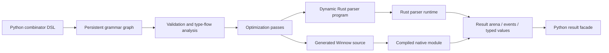

# Python-Authored Winnow Parser Combinators

## Concept and Implementation Guide

**Status:** Proposed architecture  
**Document date:** 2026-08-02  
**Reference baseline:** Winnow 1.0.4, PyO3 0.29.0, Maturin 1.14.1  
**Working package name used in examples:** `pywinnow`

---

## 1. Executive summary

It is feasible to expose a Python parser-combinator API backed by Rust and Winnow while retaining most of the performance associated with a native Rust parser. The central architectural constraint is that **Python should define the parser, but Rust should execute it**.

A naïve wrapper that calls a Python function for every parser, combinator, match, conversion, or backtracking step would cross the Python/Rust boundary repeatedly and lose much of the performance advantage. A high-performance implementation should instead:

1. Let Python build an immutable parser graph.
2. Compile that graph into a validated, optimized Rust-owned representation.
3. Cross into Rust once for each top-level parse operation.
4. Execute matching, backtracking, repetition, captures, validation, and native transformations entirely in Rust.
5. Return a compact result tree, span table, typed value, or event stream to Python at the end.

The recommended design has two execution backends:

- **Dynamic backend:** Compile the Python grammar into a compact parser IR or bytecode interpreted by a Rust runtime. This should be the default because it is immediate, serializable, cacheable, debuggable, and does not require invoking `rustc` for each grammar.
- **Native backend:** Generate ordinary monomorphized Winnow source code, compile it into a cached native extension, and load it from Python. This is the path for users who need performance closest to hand-written Rust.

The first backend will still execute in Rust, can release the Python interpreter during parsing, and should be substantially faster than a parser whose hot loop runs in Python. It will not necessarily match hand-written monomorphized Winnow because runtime dispatch, generic value representation, and dynamic grammar features introduce overhead. The native backend exists to narrow that final gap.

### Core recommendation

Build the library as a **Python grammar DSL + Rust parser compiler/runtime**, not as a thin one-to-one PyO3 wrapper over every Winnow combinator type.

---

## 2. Goals

The project should make it possible to write grammars in Python with parser-combinator ergonomics while keeping parsing itself Rust-native.

Primary goals:

- Define parsers compositionally in Python.
- Support text and binary inputs.
- Keep the parse hot path entirely in Rust by default.
- Avoid copying the complete input where practical.
- Represent captured text as spans until materialization is requested.
- Provide predictable, structured errors with source locations and context stacks.
- Support recursion, forward declarations, alternation, repetition, lookahead, cuts, separated lists, and expression parsing.
- Permit native Rust transformations without requiring users to write Rust.
- Allow arbitrary Python semantic actions, but label and isolate them as an explicit slow path.
- Support serialization, hashing, caching, introspection, visualization, and reproducible compilation of grammars.
- Provide an optional source-generation backend for maximum performance.
- Support concurrent parsing with one immutable compiled grammar and independent per-call runtime state.
- Expose Python type hints and Pydantic result models where those models are useful at the API boundary.

---

## 3. Non-goals

The first implementation should not attempt to:

- Preserve every Rust generic output type through Python.
- Expose every Winnow concrete combinator type directly as a Python class.
- Guarantee identical performance to hand-written Rust for every grammar.
- Allow arbitrary Python callbacks in the parse hot loop without a performance cost.
- Implement generalized left-recursive parsing automatically in the first release.
- Replace compiler-grade incremental parsing frameworks such as Tree-sitter for edit-aware syntax trees.
- Make Python-owned mutable objects part of detached or parallel Rust execution.
- Treat source generation and dynamic compilation as the only execution mode.

---

## 4. Feasibility assessment

### 4.1 What maps cleanly

Many parser concepts map naturally from Python into a Rust-owned IR:

- literals
- character or byte classes
- sequencing
- alternatives
- optional parsers
- bounded and unbounded repetition
- separated lists
- prefix, postfix, and infix expression operators
- lookahead and negative lookahead
- captures and spans
- discard/void operations
- context labels
- committed failures or cuts
- native numeric conversion
- native string unescaping
- native predicates
- AST node construction

These operations are declarative. Python only needs to record the requested operation and its child parser IDs.

### 4.2 What does not map directly

Winnow’s `Parser<I, O, E>` trait is generic over input, output, and error types, and its combinators typically produce deeply nested concrete Rust types. Its core entry point is mutable because parsers may be stateful `FnMut` values. PyO3 classes, by contrast, must have a single concrete runtime representation and cannot carry arbitrary Rust lifetime or generic parameters.

A Python wrapper therefore cannot preserve the full compile-time type identity of an arbitrary Winnow parser. The implementation needs to erase types at the Python boundary and reconstruct a controlled runtime model.

### 4.3 Result

The project is technically sound if it accepts the following boundary:

> Python owns parser *descriptions*. Rust owns parser *execution*.

---

## 5. Why a thin wrapper is the wrong abstraction

A literal wrapper might attempt to represent each parser as:

```rust
#[pyclass]
pub struct Parser {
    inner: Box<dyn Parser<Input, Output, Error>>,
}
```

This immediately forces fixed concrete choices for `Input`, `Output`, and `Error`. It also creates several problems:

- Outputs from all combinators must fit one erased type.
- Borrowed outputs cannot be stored directly in a Python object with input-dependent lifetimes.
- Recursive grammars become difficult to initialize safely.
- A boxed parser normally has mutable execution state, complicating shared concurrent use.
- Dynamic dispatch occurs through nested parser objects.
- Parser serialization and stable hashing become awkward.
- Introspection and optimization are limited because the grammar is hidden inside trait objects.
- Native source generation is harder because the original declarative structure has been erased.

A custom IR preserves the grammar as data and provides a place to validate and optimize it before execution.

---

## 6. High-level architecture



The architecture should be separated into five layers:

1. **Python API layer** — ergonomic combinators and type hints.
2. **Grammar model layer** — immutable parser nodes, symbols, schemas, and metadata.
3. **Compiler layer** — graph validation, normalization, optimization, and backend lowering.
4. **Runtime layer** — Rust execution over text or bytes with per-parse state.
5. **Result layer** — spans, AST nodes, values, diagnostics, and Python conversion.

---

## 7. Proposed Python API

### 7.1 Basic grammar construction

```python
from pywinnow import ascii, literal, seq

identifier = ascii.alpha1.capture("name")
integer = ascii.digit1.parse_int(base=10, bits=64, signed=False)

assignment = (
    seq(
        identifier,
        literal("=").discard(),
        integer.capture("value"),
    )
    .node("assignment")
)

parser = assignment.compile()
result = parser.parse("width=1920")
```

Grammar-construction calls should be cheap. Each call appends or interns a node in a Rust-owned or Python-owned persistent graph; it must not parse any input.

### 7.2 Operator conveniences

The library may support operators as optional syntactic sugar:

```python
identifier = ascii.alpha1
integer = ascii.digit1.parse_int()

assignment = (
    identifier.capture("name")
    + literal("=").discard()
    + integer.capture("value")
).node("assignment")

value = literal("true").value(True) | literal("false").value(False)
maybe_sign = literal("-").optional()
items = value.repeat(min=1, separator=literal(","))
```

Named functions should remain available because they are clearer in generated documentation and easier for type checkers.

### 7.3 Forward declarations and recursion

```python
from pywinnow import forward, literal, separated

value = forward("value")

array = (
    literal("[").discard()
    + separated(value, literal(","), min=0)
    + literal("]").discard()
).node("array")

value.define(string | number | array)
json_value = value.compile()
```

Compilation should reject unresolved forward declarations, direct empty recursion, and recursion cycles that cannot consume input.

### 7.4 Expression parsing

Winnow 1.0 includes a Pratt-style expression combinator. The Python API can expose a declarative equivalent:

```python
expr = expression(atom)
expr.prefix("-", binding_power=70, node="negate")
expr.postfix("!", binding_power=80, node="factorial")
expr.infix_left("*", binding_power=60, node="multiply")
expr.infix_left("+", binding_power=50, node="add")
expr.infix_right("^", binding_power=75, node="power")

compiled = expr.compile()
```

The dynamic backend can implement Pratt parsing directly. The native backend can lower this declaration to Winnow’s expression API.

### 7.5 Parsing modes

```python
parser.parse(text)                  # require complete consumption
parser.parse_prefix(text)           # return result and remaining offset
parser.find_all(text)               # repeated top-level matches
parser.parse_bytes(data)            # byte input
parser.parse_partial(chunk, state)  # streaming/partial input
parser.events(text)                 # event-oriented output
parser.validate(text)               # errors only; minimize result creation
```

`parse`, `parse_prefix`, and `validate` should be first-class runtime modes rather than Python-side wrappers around a fully materialized parse tree.

---

## 8. Python-facing model design

The high-level Python package should separate lightweight native classes from Pydantic DTOs.

### 8.1 Native classes

These objects should be implemented as PyO3 classes and remain compact:

- `ParserExpr`
- `Grammar`
- `CompiledParser`
- `ParseResult`
- `NodeView`
- `SpanView`
- `ParseState`

They should generally hold `Arc` references, integer IDs, or immutable buffers. Avoid turning every parse node into an independently allocated Python object.

### 8.2 Pydantic DTOs

Pydantic models are appropriate for exported, serialized, configuration, and diagnostic forms:

```python
from pydantic import BaseModel, ConfigDict


class Span(BaseModel):
    model_config = ConfigDict(frozen=True)

    start: int
    end: int


class Diagnostic(BaseModel):
    model_config = ConfigDict(frozen=True)

    message: str
    offset: int
    line: int | None = None
    column: int | None = None
    expected: tuple[str, ...] = ()
    contexts: tuple[str, ...] = ()


class GrammarSummary(BaseModel):
    model_config = ConfigDict(frozen=True)

    hash: str
    node_count: int
    entrypoint: str
    backend: str
    optimizations: tuple[str, ...]
```

Converting a large AST into nested Pydantic models should be opt-in because eager conversion can dominate parse time.

### 8.3 Lazy result facade

The default result should be backed by a Rust arena:

```python
result = parser.parse(source)
root = result.root

print(root.kind)
print(root.span)
print(root["name"].text())

# Explicitly materialize when needed:
data = root.to_dict()
model = AssignmentModel.model_validate(data)
```

This keeps native parsing fast while preserving an ergonomic Python interface.

---

## 9. Grammar intermediate representation

### 9.1 Design requirements

The grammar IR should be:

- immutable after compilation
- serializable
- stable-hashable
- versioned
- backend-neutral
- independent of Python object identity
- suitable for graph validation
- suitable for source generation
- explicit about whether a node consumes input
- explicit about output shape
- able to reference interned strings and character sets

### 9.2 Suggested Rust structures

```rust
pub type NodeId = u32;
pub type SymbolId = u32;
pub type TransformId = u16;

#[derive(Clone, Debug, serde::Serialize, serde::Deserialize)]
pub struct GrammarIr {
    pub format_version: u32,
    pub nodes: Vec<Node>,
    pub symbols: Vec<String>,
    pub entrypoints: Vec<Entrypoint>,
    pub output_schemas: Vec<OutputSchema>,
    pub metadata: GrammarMetadata,
}

#[derive(Clone, Debug, serde::Serialize, serde::Deserialize)]
pub struct Node {
    pub op: ParserOp,
    pub output: OutputSchemaId,
    pub flags: NodeFlags,
    pub context: Option<SymbolId>,
}

#[derive(Clone, Debug, serde::Serialize, serde::Deserialize)]
pub enum ParserOp {
    Empty,
    Fail { message: Option<SymbolId> },

    LiteralText { value: SymbolId, case: CaseMode },
    LiteralBytes { value: BlobId },
    AnyChar,
    AnyByte,
    CharSet { set: CharSetId },
    ByteSet { set: ByteSetId },
    Take { count: usize, unit: CountUnit },
    TakeWhile { set: SetId, min: usize, max: Option<usize> },

    Sequence { children: Vec<NodeId> },
    Choice { children: Vec<NodeId>, strategy: ChoiceStrategy },
    Optional { child: NodeId },
    Repeat {
        child: NodeId,
        min: usize,
        max: Option<usize>,
        separator: Option<NodeId>,
        trailing: TrailingSeparator,
    },

    Peek { child: NodeId },
    Not { child: NodeId },
    Cut { child: NodeId },
    Context { child: NodeId, label: SymbolId },

    Capture { child: NodeId, name: Option<SymbolId>, mode: CaptureMode },
    Discard { child: NodeId },
    Constant { child: NodeId, value: ConstValue },
    Transform { child: NodeId, transform: NativeTransform },
    Verify { child: NodeId, predicate: NativePredicate },
    Node { child: NodeId, kind: SymbolId, fields: Vec<FieldBinding> },

    RuleRef { rule: RuleId },
    Pratt { specification: PrattSpecId },
}
```

### 9.3 Persistent grammar construction

Python parser expressions should behave as immutable values:

```python
base = ascii.alpha1
captured = base.capture("name")
optional = base.optional()
```

None of these operations should mutate `base`. Internally, parser expressions can share an `Arc<GrammarBuilder>` and refer to a node ID. A builder can use structural interning so identical literal and character-set nodes are reused.

### 9.4 Output schema flow

Every parser operation should have an output schema known at compile time, even if the actual Python type is dynamic.

Example schema kinds:

```rust
pub enum OutputSchema {
    Unit,
    Bool,
    Int { bits: u8, signed: bool },
    Float { bits: u8 },
    Span,
    TextSpan,
    ByteSpan,
    Constant(ConstType),
    Optional(OutputSchemaId),
    Sequence(Vec<OutputSchemaId>),
    List(OutputSchemaId),
    Node(NodeSchemaId),
    Dynamic,
}
```

Schema flow enables:

- validation of `.select()` and field bindings
- efficient result storage
- generated Python typing information
- native-backend source generation
- specialized runtime instructions
- fewer tagged unions in common paths

---

## 10. Compilation pipeline

Compilation should be explicit:

```python
compiled = grammar.compile(
    entrypoint="document",
    backend="dynamic",
    optimize=2,
    result_mode="arena",
)
```

### 10.1 Validation

The compiler should check:

- all referenced nodes and rules exist
- all forward declarations are resolved
- no repetition can loop forever through a child that succeeds without consuming input
- field names are unique where required
- selected tuple indexes are valid
- text parsers are not mixed with byte-only operations without an explicit conversion
- callbacks are permitted by the selected execution policy
- recursive rules have a valid consuming path
- output schemas agree at control-flow joins
- native transforms accept the child schema
- entrypoints are defined

### 10.2 Normalization

Normalize high-level conveniences into a small core language:

- `preceded(a, b)` → sequence + selection
- `terminated(a, b)` → sequence + selection
- `delimited(a, b, c)` → sequence + selection
- `separated_pair(a, s, b)` → sequence + selection
- `.value(x)` → child + constant
- `.void()` → discard
- operator sugar → sequence/choice/repeat

Keeping the execution instruction set small simplifies optimization and testing.

### 10.3 Static analysis

Compute per-node properties:

- nullable: can succeed without consuming input
- minimum consumed length
- fixed consumed length, if known
- first-byte or first-character set
- can backtrack
- can fail after consuming
- requires location tracking
- requires result allocation
- contains Python callbacks
- recursion depth behavior
- deterministic-prefix information

These properties enable both correctness checks and optimization.

### 10.4 Optimization passes

Recommended passes:

1. **Literal fusion**  
   Merge adjacent discarded literals into one literal.

2. **Sequence flattening**  
   Collapse nested sequences.

3. **Choice flattening**  
   Collapse nested alternatives when cut semantics permit it.

4. **Prefix dispatch**  
   Convert alternatives with disjoint prefixes into table or trie dispatch. Winnow itself documents `dispatch` as a faster option than a generic `alt` when branches have unique prefixes.

5. **Character-set fusion**  
   Merge equivalent ASCII predicates into bitsets.

6. **Discard propagation**  
   Avoid constructing values that a parent discards.

7. **Span-only lowering**  
   Replace temporary substring objects with start/end offsets.

8. **Repeat specialization**  
   Specialize common loops such as `digit1`, whitespace, CSV-style separated lists, and fixed-width repetition.

9. **Result schema specialization**  
   Emit typed slots for common scalar values rather than a fully dynamic enum.

10. **Memoized literal tables**  
    Intern literals and precompute search structures.

11. **Validation-only pruning**  
    Remove AST/result instructions when the caller only requests validation.

12. **Tail rule elimination**  
    Convert simple tail-recursive rules into loops.

### 10.5 Lowering

The compiler lowers normalized nodes to one of:

- dynamic runtime instructions
- generated Winnow source
- optional future specialized JIT representation

---

## 11. Dynamic Rust backend

### 11.1 Why a dedicated runtime

The dynamic backend should not merely execute a tree of heap-allocated trait objects. A compact program representation can provide:

- contiguous instruction storage
- integer node IDs rather than pointer-heavy graphs
- compact literal and character-set tables
- predictable per-parse stacks
- explicit checkpoints
- specialized instructions
- easier profiling
- no Python interaction in the hot loop

### 11.2 Execution model options

#### Option A: Recursive IR interpreter

Each parser node invokes child nodes recursively.

Advantages:

- simplest implementation
- closely matches combinator semantics
- easy to debug

Disadvantages:

- Rust call-stack depth follows grammar recursion
- dynamic dispatch on every node
- more difficult to pause and resume partial parsing

#### Option B: Explicit parser VM

Compile grammar nodes into instructions and use explicit stacks.

Advantages:

- compact execution state
- controlled recursion limits
- pause/resume support
- easier tracing and profiling
- potential for instruction fusion
- suitable for streaming

Disadvantages:

- more implementation complexity
- backtracking and semantic-value rollback require careful design

#### Recommendation

Start with a recursive, arena-backed evaluator for semantic correctness, but design the IR and runtime state so it can evolve into an explicit VM without changing the Python API or serialized grammar format.

### 11.3 Runtime state

```rust
pub struct ParseRuntime<'input> {
    pub program: &'input CompiledProgram,
    pub input: InputView<'input>,
    pub cursor: usize,
    pub checkpoints: Vec<Checkpoint>,
    pub values: ValueArena,
    pub nodes: NodeArena,
    pub captures: CaptureArena,
    pub contexts: Vec<ContextFrame>,
    pub errors: ErrorAccumulator,
    pub limits: RuntimeLimits,
}
```

The compiled parser remains immutable. Every call creates its own runtime, enabling safe concurrent reuse.

### 11.4 Checkpoints and rollback

Backtracking must restore:

- cursor position
- value arena length
- node arena length
- capture arena length
- context depth
- recoverable error state

A checkpoint can therefore contain lengths rather than complete copies:

```rust
pub struct Checkpoint {
    cursor: usize,
    value_len: usize,
    node_len: usize,
    capture_len: usize,
    context_len: usize,
}
```

Rollback truncates arenas to recorded lengths. This keeps speculative parsing relatively cheap.

### 11.5 Relationship to Winnow

The runtime can use Winnow in three ways:

1. Use Winnow primitives internally for low-level token, numeric, and stream operations.
2. Reimplement a compact set of normalized combinator semantics in the VM while retaining Winnow-compatible behavior.
3. Lower selected static subgraphs into boxed Winnow parsers.

The recommended approach is hybrid: use Winnow’s well-tested primitives and semantics where they fit, but avoid forcing the entire runtime grammar into deeply nested boxed trait objects.

---

## 12. Native generated backend

### 12.1 Purpose

The native backend converts the grammar IR into Rust source that uses ordinary Winnow combinators and concrete output types. The Rust compiler can then monomorphize, inline, and optimize the parser similarly to hand-written code.

### 12.2 User experience

```python
native = grammar.compile(
    backend="native",
    cache_dir=".pywinnow-cache",
    release=True,
)

result = native.parse(source)
```

Compilation should be content-addressed. The cache key should include:

- canonical grammar IR hash
- code-generator version
- Winnow version
- PyO3 version
- Rust target triple
- compiler version and relevant flags
- Python ABI tag
- requested result mode
- enabled native transforms

### 12.3 Generated source example

A Python declaration such as:

```python
assignment = seq(
    ascii.alpha1.capture("name"),
    literal("=").discard(),
    ascii.digit1.parse_int().capture("value"),
).node("assignment")
```

could lower to conceptually similar Rust:

```rust
fn assignment<'i>(
    input: &mut LocatingSlice<&'i str>,
) -> ModalResult<AssignmentSpan> {
    seq!(AssignmentSpan {
        name: alpha1.span(),
        _: '=',
        value: dec_uint::<_, u64, _>.with_span(),
    })
    .parse_next(input)
}
```

The actual generator may produce explicit functions rather than macro-heavy output to simplify diagnostics and source maps.

### 12.4 Loading strategy

Possible strategies:

- compile one extension module per grammar
- compile several grammars into one cache module
- compile a native Rust shared library exposing a stable C ABI consumed by the main PyO3 module

A stable C ABI layer can reduce Python extension initialization complexity and avoid loading many independent PyO3 modules. The main package can retain ownership of Python conversion while generated libraries only execute parser functions and return serialized or arena-backed native results.

### 12.5 Native backend limitations

- nontrivial compile latency
- requires a Rust toolchain at grammar compilation time
- cache invalidation complexity
- platform-specific artifacts
- generated error messages need mapping back to Python grammar nodes
- arbitrary Python callbacks prevent full native detachment
- dynamic grammar changes require recompilation

The backend should be optional rather than required for ordinary use.

---

## 13. Input ownership and zero-copy behavior

### 13.1 Python strings and bytes

PyO3 provides owned wrappers such as `PyBackedStr` that keep the originating Python object alive while exposing Rust string data. `PyBackedStr` is `Send` and `Sync`, making it suitable for Rust-only work detached from the interpreter.

The parse entry point can conceptually be:

```rust
#[pymethods]
impl CompiledParser {
    fn parse(
        &self,
        py: Python<'_>,
        input: PyBackedStr,
    ) -> PyResult<ParseResult> {
        let program = Arc::clone(&self.program);
        let result = py.detach(move || program.parse_text(input.as_ref()));
        result.map(ParseResult::from).map_err(Into::into)
    }
}
```

### 13.2 Span-first outputs

Returning a Rust `&str` directly to a long-lived Python result is not appropriate because its lifetime is tied to the input. Instead, store:

- an owned reference to the original Python string or bytes object
- start and end offsets
- encoding or input kind

```rust
pub struct SourceBuffer {
    source: SourceOwner,
}

pub struct Span {
    start: u32,
    end: u32,
}
```

`NodeView.text()` can materialize a Python substring on demand. This preserves the input and avoids eager allocation for every capture.

### 13.3 Unicode offsets

The API must define offset units clearly. Recommended choices:

- internal text cursor: UTF-8 byte offset
- public `Span.start` and `Span.end`: UTF-8 byte offsets by default
- optional conversion methods for Unicode code point, line/column, and UTF-16 offsets

Using byte offsets aligns with Rust string slicing and Winnow’s byte-oriented design. Line and column indexes should be computed lazily or through an optional line index.

### 13.4 Bytes mode

Binary parsing should use a parallel input path:

```python
packet = (
    binary.u16_be.capture("length")
    + binary.take_from_field("length").capture("payload")
).node("packet")
```

Initial releases may constrain data-dependent lengths to a set of native instructions instead of arbitrary Python functions.

---

## 14. Output representation

### 14.1 Value arena

A generic output enum is useful, but allocating one large enum per parser step can be costly. Use a compact arena with specialized storage.

```rust
pub enum ValueRef {
    Unit,
    Bool(bool),
    Int(i64),
    UInt(u64),
    Float(f64),
    Span(SpanId),
    Node(NodeId),
    List(ListId),
    Tuple(TupleId),
    Constant(ConstId),
}
```

Large text values should remain spans.

### 14.2 AST node arena

```rust
pub struct AstNode {
    kind: SymbolId,
    span: Span,
    first_field: u32,
    field_count: u16,
}

pub struct AstField {
    name: SymbolId,
    value: ValueRef,
}
```

Nodes and fields in contiguous vectors minimize allocation and improve traversal locality.

### 14.3 Result modes

Expose several modes because not every parse needs a full AST:

| Mode | Purpose | Allocation profile |
|---|---|---:|
| `validate` | Success/failure only | Minimal |
| `spans` | Captures and source ranges | Low |
| `events` | Streaming start/end/token events | Low to moderate |
| `arena` | Lazy native AST | Moderate |
| `python` | Eager Python values | High |
| `pydantic` | Validated application DTOs | Highest |

`arena` should be the default for structured parsing.

### 14.4 Event mode

An event-oriented parser can support large documents without constructing a complete tree:

```python
for event in parser.events(source):
    match event.kind:
        case "start": ...
        case "token": ...
        case "end": ...
```

For maximum throughput, events should be batched across the boundary rather than yielding one Python object per event.

---

## 15. Native transformations and predicates

### 15.1 Native transform registry

A registry of built-in Rust transformations provides useful semantics without Python callbacks:

```python
number = ascii.digit1.transform("parse_u64")
string = quoted.transform("json_unescape")
name = identifier.transform("intern_symbol")
```

Suggested built-ins:

- integer parsing by base, width, and signedness
- floating-point parsing
- boolean and null constants
- hex/base64 decoding
- JSON, C, shell, or custom escape decoding
- ASCII case conversion
- Unicode normalization, where explicitly requested
- trimming
- checked range conversion
- timestamp/date parsing through controlled formats
- UUID parsing
- byte-order conversion
- symbol interning
- enum lookup
- AST node construction
- tuple/list projection

### 15.2 Parameterized transformations

```python
port = ascii.digit1.parse_int(
    bits=16,
    signed=False,
).verify_range(min=1, max=65535)
```

Store transform parameters as serializable data in the IR.

### 15.3 User-defined Rust plugins

A future plugin ABI could allow custom native transforms without modifying the core package:

```python
from pywinnow.plugins import load_native_plugin

plugin = load_native_plugin("my_parser_transforms.so")
parser = token.transform(plugin.transform("parse_domain_type"))
```

A stable plugin ABI is a substantial commitment. It should follow the core MVP rather than precede it.

---

## 16. Python callbacks: supported slow path

### 16.1 API

```python
number = ascii.digit1.map_python(int)
```

This should be permitted for ergonomics, but it must have explicit semantics:

- The parser cannot remain detached while invoking the callback.
- Python object conversion occurs at every callback site.
- Backtracking may cause callbacks to run more than once unless the runtime defers them.
- Parallel parsing may be restricted by callback thread-safety and interpreter behavior.
- Grammar serialization cannot include an arbitrary callable reproducibly.
- Native source generation cannot fully compile through the callback.

### 16.2 Preferred deferred callback semantics

Instead of invoking Python during speculative parsing, represent a successful callback site as a deferred action:

1. Rust parses and records the captured span and callback ID.
2. The final successful parse determines which actions survive.
3. Rust returns a compact action batch.
4. Python executes callbacks after parsing.
5. Results are inserted into the final Python materialization.

This avoids repeated callback execution during backtracking and preserves a Rust-only parse hot path. It does not allow a callback’s result to affect subsequent parsing.

### 16.3 Immediate callbacks

Immediate callbacks are required for context-sensitive parsing where the callback output controls later behavior. They should be exposed under a deliberately explicit name:

```python
parser = prefix.bind_python(build_following_parser)
```

This mode should:

- be disabled in detached execution
- be rejected by the native backend unless a fallback trampoline is generated
- be identified in grammar summaries
- emit a performance warning under an optional diagnostics policy

### 16.4 Callback policy

```python
compiled = grammar.compile(
    callbacks="forbid",  # forbid | deferred | immediate
)
```

Production systems can use `forbid` to guarantee a Rust-only execution path.

---

## 17. Error model

### 17.1 Error categories

The runtime should distinguish:

- **backtrack error:** a branch did not match and another branch may be tried
- **committed error:** a cut or consuming decision prevents trying peers
- **incomplete input:** more input may allow parsing to continue
- **external/native transform error:** conversion failed
- **resource-limit error:** recursion, input, result, or backtracking limit exceeded
- **grammar error:** invalid compiled grammar; normally detected before parsing

This maps naturally to Winnow’s error-mode concepts while allowing a stable Python-facing API.

### 17.2 Structured diagnostic

```python
try:
    parser.parse(source)
except ParseError as exc:
    print(exc.diagnostic.message)
    print(exc.diagnostic.offset)
    print(exc.diagnostic.expected)
    print(exc.diagnostic.contexts)
```

A diagnostic should include:

- farthest failure offset
- expected terminals or rule labels
- context stack
- committed/backtracking status
- source span
- optional line/column
- optional excerpt and caret rendering
- rule and grammar node IDs for debugging
- original native transform error, if any

### 17.3 Farthest-error accumulation

Alternation can generate many errors. By default, preserve the error at the greatest consumed offset and merge a bounded set of expected labels at that position. This provides useful errors without retaining every speculative failure.

### 17.4 Context labels

```python
email = local_part.context("email local part") + literal("@") + domain
```

Context labels should be interned and recorded only when error reporting is enabled. A `fast` runtime profile may reduce context bookkeeping.

---

## 18. Recursion and left recursion

### 18.1 Supported recursion

Forward-declared recursive rules should support conventional recursive-descent grammars where recursive paths consume input before recursing.

### 18.2 Unsafe cycles

Reject grammars such as:

```python
rule.define(rule.optional())
```

This can succeed without consuming input and recurse forever.

The compiler’s nullability analysis should detect cycles whose strongly connected components have a zero-consumption path.

### 18.3 Left recursion

Direct left recursion such as:

```text
expr := expr "+" term | term
```

is not appropriate for a basic recursive-descent backend. Users should express operator grammars through the Pratt/expression API or rewrite them into iterative form.

Packrat-style left-recursion support could be explored later, but it would change memory and performance characteristics and should not be hidden behind ordinary combinator syntax.

### 18.4 Runtime limits

Provide limits to protect against malicious or accidental pathological input:

```python
parser.parse(
    source,
    limits=ParseLimits(
        max_recursion=1024,
        max_backtracks=10_000_000,
        max_nodes=5_000_000,
        max_capture_bytes=256_000_000,
    ),
)
```

`ParseLimits` should be a frozen Pydantic configuration model at the Python boundary.

---

## 19. Streaming and partial parsing

Winnow supports partial/incomplete input concepts. The Python library can expose them through an explicit state object.

```python
state = parser.begin()

for chunk in chunks:
    outcome = state.feed(chunk)
    if outcome.is_complete:
        value = outcome.result
        break

state.finish()
```

### 19.1 State ownership

A streaming state owns or references accumulated input. Three policies are possible:

- **retain all input:** simplest; spans remain stable
- **sliding buffer:** lower memory, but spans need global offsets and captures may require copying
- **user-managed chunks:** advanced mode with strict lifetime and pinning requirements

The MVP should retain input and expose global byte offsets. Sliding-buffer support can follow after semantics are stable.

### 19.2 Resumable VM advantage

An explicit VM is better suited than a recursive interpreter for suspension because the current instruction, stacks, and checkpoints are already data rather than Rust call-stack frames.

### 19.3 Python chunk crossing

Feed chunks in reasonably large units. Calling into Rust for every byte or tiny token would recreate the boundary-overhead problem the architecture is intended to avoid.

---

## 20. Concurrency and Python interpreter behavior

### 20.1 Immutable compiled parser

`CompiledParser` should contain immutable shared state:

```rust
#[pyclass(frozen)]
pub struct CompiledParser {
    program: Arc<CompiledProgram>,
}
```

Each parse gets independent runtime state. No mutex should be required for ordinary parsing.

### 20.2 Detaching from Python

PyO3 recommends `Python::detach` for long-running Rust-only work. The parser can detach when:

- the input is represented by a Rust-safe owned view such as `PyBackedStr` or copied bytes
- the grammar contains no immediate Python callbacks
- the result arena contains no interpreter-bound references

This permits other Python threads to continue and remains relevant for both GIL-enabled and free-threaded Python builds.

### 20.3 Free-threaded Python

The design should avoid relying on the GIL for internal synchronization. PyO3 classes must be thread-safe by default, and mutable `pyclass` borrowing can raise runtime errors under concurrent access. Immutable compiled parsers plus per-call runtime values avoid this problem.

### 20.4 Parallel batch parsing

```python
results = parser.parse_many(
    documents,
    parallel=True,
    workers=8,
    ordered=True,
)
```

`parse_many` should perform batching in Rust and release the interpreter once. It can use a native thread pool without one Python/Rust crossing per document. Results should be returned as a batch facade with lazy item access.

---

## 21. Grammar serialization and caching

### 21.1 Canonical format

A compiled or precompiled grammar should be serializable:

```python
grammar.save("grammar.pwg")
loaded = Grammar.load("grammar.pwg")
```

Suggested contents:

- magic bytes
- format version
- canonical grammar IR
- interned strings and blobs
- output schemas
- entrypoints
- source/debug metadata
- optional optimized dynamic program
- integrity hash

Use a stable binary encoding such as a carefully versioned custom format, postcard, or MessagePack-like encoding. Do not serialize raw Rust memory layouts.

### 21.2 Stable grammar hash

The hash should exclude non-semantic metadata such as source file paths unless debugging reproducibility requires them. It should include semantic transform parameters and callback policy.

### 21.3 Cache layers

- Python grammar-expression interning
- validated IR cache
- optimized dynamic-program cache
- native generated-source cache
- compiled artifact cache
- line-index cache per parsed source

### 21.4 Arbitrary callbacks

Python callables make portable serialization difficult. Options:

- reject serialization
- serialize an import path plus explicit version token
- require callbacks to be registered by name at load time
- serialize only the Rust-executable portion and attach callbacks afterward

The safest default is to reject serialization of grammars containing unregistered arbitrary callbacks.

---

## 22. Winnow feature mapping

The wrapper should document which Winnow concepts are represented directly, adapted, or deferred.

| Winnow concept | Python API status | Dynamic backend | Native backend |
|---|---|---|---|
| Literal/token parsers | Direct | Native instruction | Winnow primitive |
| ASCII parsers | Direct | Specialized instruction | Winnow ASCII parser |
| Tuple/sequence parsers | Direct | Sequence instruction | Tuple or `seq!` |
| `alt` | Direct | Choice instruction | `alt` |
| `dispatch` | Compiler optimization/API | Trie/table dispatch | `dispatch!` |
| `opt` | Direct | Optional instruction | `opt` |
| `repeat` | Direct | Repeat loop | `repeat` |
| separated lists | Direct | Specialized repeat | Winnow separated combinator |
| `peek` | Direct | Checkpoint/no consume | `peek` |
| `not` | Direct | Checkpoint/negate | `not` |
| `cut_err` semantics | Direct as `.cut()` | Committed error | Winnow cut combinator |
| `.take()` / `.span()` | Direct | Span output | Winnow span/take |
| `.map()` | Native registry or callback | Native/deferred/immediate | Generated closure or trampoline |
| `.verify()` | Native predicate or callback | Native/deferred/immediate | Generated closure or trampoline |
| stateful streams | Controlled API | Runtime state | `Stateful` where appropriate |
| partial streams | Explicit streaming API | Resumable state | Winnow partial parsing |
| recovery | Later milestone | Runtime recovery op | Winnow recovery APIs |
| expression/Pratt parsing | Direct DSL | Native Pratt runtime | Winnow expression API |

---

## 23. Performance model

### 23.1 Expected cost centers

The dynamic backend’s likely overhead relative to hand-written Winnow comes from:

- instruction or node dispatch
- erased output representation
- result arena bookkeeping
- dynamic branch structures
- reduced compiler inlining across grammar boundaries
- optional error/context tracking

The major costs to avoid are:

- one Python call per token or combinator
- eager Python object creation for every capture
- copying the entire input unnecessarily
- allocating substrings for captures
- heap allocation per parser node during execution
- global locks around a shared mutable parser

### 23.2 Performance tiers

Define explicit tiers rather than claiming universal Rust-equivalent performance:

1. **Validation tier** — Rust-only recognition with minimal outputs.
2. **Span tier** — Rust-only parsing with capture spans.
3. **Arena AST tier** — Rust-only structured result construction.
4. **Eager Python tier** — parse plus Python object conversion.
5. **Callback tier** — parse with Python semantic actions.
6. **Native generated tier** — monomorphized Winnow for stable grammars.

### 23.3 Proposed acceptance targets

These are engineering targets, not measured claims:

- One Python/Rust crossing for one top-level `parse()`.
- Zero Python callbacks in a grammar compiled under `callbacks="forbid"`.
- No full-input copy for ordinary `str` and `bytes` inputs when supported by the selected ownership path.
- No captured-substring allocation in span or arena modes.
- Dynamic validation throughput within a bounded factor of the generated backend on representative grammars; establish the actual threshold after the first benchmark suite.
- Batch parsing scales across native worker threads for callback-free grammars.
- Python materialization time reported separately from Rust parse time.

Do not set a hard “within 10% of native” promise before prototypes identify the actual grammar-dependent range.

### 23.4 Benchmark dimensions

Measure:

- input size
- grammar node count
- match success and failure
- shallow and deep backtracking
- number of captures
- AST node count
- text versus bytes
- ASCII versus Unicode
- error-reporting level
- callback count
- single parse versus batch
- single-thread versus parallel batch
- dynamic versus generated backend
- eager versus lazy result conversion

---

## 24. Benchmark suite

### 24.1 Comparative implementations

For each benchmark grammar, compare:

- hand-written Winnow
- generated Winnow backend
- dynamic IR backend
- direct boxed-parser prototype, if retained for comparison
- representative pure-Python combinator implementation
- Python `re` where the task is regex-equivalent

The objective is not to claim that one parser style wins every workload; it is to identify where dynamic abstraction costs appear.

### 24.2 Suggested grammars

- integer and floating-point lists
- CSV subset
- JSON
- TOML subset
- HTTP headers
- shell-like command tokenization
- expression language
- binary packet format
- deeply nested parentheses
- ambiguous-prefix alternatives
- failure at beginning, middle, and end
- high-capture log format

### 24.3 Reporting

Report separately:

- grammar construction time
- compile/optimization time
- native code-generation and Rust compilation time
- Rust parse time
- result materialization time
- total end-to-end Python call time
- peak memory
- allocations, where measurable

This separation is essential. A fast Rust parse can appear slow if the benchmark eagerly turns a million nodes into Python dictionaries.

---

## 25. Debugging and introspection

A dynamic grammar should be easier to inspect than nested Rust combinator types.

```python
print(grammar.summary())
grammar.write_dot("grammar.dot")
compiled.explain()
compiled.explain(node=assignment)
```

Useful tooling:

- graph visualization
- normalized IR dump
- output-schema dump
- nullable/minimum-length analysis
- first-set display
- detected dispatch opportunities
- callback inventory
- optimization report
- backend-generated Rust source
- parse trace with bounded events
- flamegraph-friendly node labels
- error-path trace

### 25.1 Trace mode

```python
trace = parser.trace(source, max_events=10_000)
```

Trace mode should be disabled by default and compiled into an alternate runtime path or guarded by a cheap flag. It must not impose substantial overhead on normal parsing.

---

## 26. Packaging and repository layout

### 26.1 Suggested repository

```text
pywinnow/
├── Cargo.toml
├── pyproject.toml
├── README.md
├── crates/
│   ├── pywinnow-ir/
│   ├── pywinnow-compiler/
│   ├── pywinnow-runtime/
│   ├── pywinnow-codegen/
│   ├── pywinnow-plugin-api/
│   └── pywinnow-python/
├── python/
│   └── pywinnow/
│       ├── __init__.py
│       ├── api.py
│       ├── models.py
│       ├── typing.py
│       └── py.typed
├── benchmarks/
├── examples/
├── tests/
└── docs/
```

### 26.2 Crate responsibilities

- `pywinnow-ir`: serialized grammar and output schemas
- `pywinnow-compiler`: validation, analysis, normalization, optimization
- `pywinnow-runtime`: dynamic execution engine
- `pywinnow-codegen`: generated Winnow source and build cache
- `pywinnow-plugin-api`: optional future native transform ABI
- `pywinnow-python`: PyO3 classes and conversion layer

### 26.3 Build tooling

Maturin is the natural packaging tool for the primary Python extension. Ship type information using a manually maintained `.pyi` or typed Python facade initially; PyO3’s automatic stub generation remains an evolving area.

### 26.4 ABI strategy

Consider an `abi3` wheel only after checking whether all required PyO3 and free-threading features are compatible with the selected Python support matrix. Performance-sensitive APIs should not be constrained prematurely by an ABI choice.

---

## 27. Testing strategy

### 27.1 Unit tests

- every primitive parser operation
- sequence and selection behavior
- rollback correctness
- cut/commit semantics
- optional and repetition nullability rules
- span correctness
- UTF-8 boundary handling
- binary endianness
- numeric overflow
- transform errors
- farthest-error merging
- recursion limits
- streaming suspension and resume

### 27.2 Differential tests

For operations that correspond directly to Winnow, generate random inputs and compare the dynamic backend against a native Winnow reference parser.

### 27.3 Property-based tests

Use Rust `proptest` for:

- checkpoint rollback invariants
- parse cursor monotonicity outside rollback
- no successful unbounded repetition without consumption
- serialization round trips
- optimization equivalence
- dynamic/native backend equivalence
- no invalid UTF-8 slicing

Use Python Hypothesis for public API composition and Python conversion behavior.

### 27.4 Fuzzing

Fuzz:

- serialized grammar loader
- grammar compiler
- parser runtime with random valid grammars
- malformed UTF-8 in byte mode
- deeply nested inputs
- native transform parameter decoding
- result arena traversal

The grammar loader must treat files as untrusted input and enforce size and structure limits.

### 27.5 Concurrency tests

- one parser called from many Python threads
- callback-free parsing while detached
- parallel `parse_many`
- parser destruction while results still exist
- free-threaded Python CI where available
- cancellation or interruption behavior

---

## 28. Security and robustness

### 28.1 Resource exhaustion

Parser combinators can exhibit pathological backtracking. Provide configurable limits and an option to statically warn about overlapping alternatives.

### 28.2 Generated code

The native backend should generate Rust only from validated IR and controlled templates. Do not interpolate arbitrary user strings into Rust source without escaping. Literals should be emitted through safe byte arrays or escaped string literal generators.

### 28.3 Cache integrity

- content-address native artifacts
- verify metadata before loading
- isolate compilation output directories
- avoid loading world-writable cached libraries
- allow users to disable native compilation
- consider signing or origin metadata for shared caches

### 28.4 Native plugins

A native plugin is equivalent to arbitrary native code execution. Plugin loading should be explicit and outside the default safe grammar format.

### 28.5 Python callbacks

Callbacks can execute arbitrary Python code. Their presence should be visible in grammar summaries and excluded from “pure native” guarantees.

---

## 29. Phased implementation plan

### Phase 0: Technical spikes

Build three small prototypes:

1. direct boxed Winnow parser graph
2. recursive custom IR evaluator using Winnow primitives
3. generated Winnow parser for the same Python grammar

Benchmark a literal/sequence grammar, JSON subset, and ambiguous alternative grammar. The purpose is to validate architecture choices, not create the public API.

**Exit criteria:**

- quantify dynamic dispatch and result-erasure overhead
- verify input ownership without full copying
- verify detached parsing
- demonstrate span-backed lazy results
- confirm generated backend cache workflow

### Phase 1: Minimal dynamic parser

Implement:

- text literals
- ASCII classes
- sequence
- choice
- optional
- repeat
- discard
- capture spans
- complete and prefix parsing
- structured errors
- immutable compiled parser
- PyO3 bindings
- typed Python facade

**Exit criteria:** Parse a JSON subset without Python callbacks and return a lazy arena tree.

### Phase 2: Compiler and optimization

Implement:

- canonical IR
- serialization
- nullability and minimum-length analysis
- sequence/choice flattening
- literal fusion
- prefix dispatch
- validation-only mode
- grammar introspection

**Exit criteria:** Stable grammar hash, load/save round trip, and measurable improvement from at least two optimization passes.

### Phase 3: Semantic values

Implement:

- native numeric transforms
- constants
- node construction
- typed value slots
- native predicates
- deferred Python callbacks
- eager conversion options

**Exit criteria:** Parse JSON into either a native arena or ordinary Python values with separately measured conversion cost.

### Phase 4: Recursion and expressions

Implement:

- forward rules
- recursion validation
- Pratt expression parser
- runtime recursion limits

**Exit criteria:** Parse a nested language and a configurable operator expression grammar.

### Phase 5: Native code-generation backend

Implement:

- Rust source generator
- cache-key system
- Maturin/Cargo build orchestration
- generated artifact loader
- source maps from grammar nodes to generated Rust
- dynamic/native equivalence tests

**Exit criteria:** A stable Python grammar can compile to a cached native parser and produce equivalent results to the dynamic backend.

### Phase 6: Bytes and streaming

Implement:

- bytes primitives
- endian numeric parsers
- partial input state
- resumable runtime or VM
- batched feed operations

### Phase 7: Advanced capabilities

Candidates:

- error recovery
- event-mode parsing
- parallel batch parsing
- native transform plugins
- grammar profile-guided optimization
- specialized code generation for stable subgraphs
- standalone parser artifact export

---

## 30. Initial API surface

A restrained first release should expose roughly the following:

```python
# primitives
literal(value)
any_char()
one_of(values)
none_of(values)
take(count)
take_while(predicate, *, min=0, max=None)

# composition
seq(*parsers)
choice(*parsers)
optional(parser)
repeat(parser, *, min=0, max=None)
separated(parser, separator, *, min=0, max=None, trailing=False)
peek(parser)
not_(parser)
forward(name)

# parser methods
parser.capture(name=None)
parser.discard()
parser.value(value)
parser.node(kind, **field_bindings)
parser.context(label)
parser.cut()
parser.parse_int(...)
parser.verify_range(...)
parser.map_python(callback)
parser.compile(...)

# compiled parser
compiled.parse(input)
compiled.parse_prefix(input)
compiled.validate(input)
compiled.parse_many(inputs, ...)
compiled.summary()
compiled.dump_ir()
```

Avoid exposing dozens of near-duplicate convenience functions before the core semantics stabilize.

---

## 31. Complete example: small configuration language

### 31.1 Python grammar

```python
from pywinnow import ascii, choice, forward, literal, separated, seq

ws = ascii.whitespace0.discard()
lexeme = lambda parser: parser + ws

identifier = lexeme(
    seq(
        ascii.alpha | literal("_"),
        (ascii.alphanumeric | literal("_")).repeat(),
    ).capture()
)

integer = lexeme(
    seq(
        literal("-").optional(),
        ascii.digit1,
    ).capture().parse_int(bits=64, signed=True)
)

string = lexeme(
    literal('"').discard()
    + ascii.none_of('"\\').repeat().capture().json_unescape()
    + literal('"').discard()
)

value = forward("value")

array = (
    lexeme(literal("[")).discard()
    + separated(value, lexeme(literal(",")), min=0)
    + lexeme(literal("]")).discard()
).node("array", items=0)

scalar = choice(
    integer,
    string,
    lexeme(literal("true")).value(True),
    lexeme(literal("false")).value(False),
)

value.define(choice(array, scalar))

assignment = seq(
    identifier.capture("name"),
    lexeme(literal("=")).discard(),
    value.capture("value"),
).node("assignment")

document = (
    ws
    + assignment.repeat(min=0, separator=ascii.newline1)
).node("document", assignments=0)

parser = document.compile(
    backend="dynamic",
    callbacks="forbid",
    result_mode="arena",
)
```

### 31.2 Execution behavior

For input:

```text
width = 1920
height = 1080
tags = ["demo", "parser"]
enabled = true
```

Rust should:

1. Hold the source through an owned input view.
2. Detach from Python.
3. Execute the parser graph.
4. Store captures as byte spans.
5. Store integers and booleans as native scalar slots.
6. Construct node and field arenas.
7. Reattach only to return the result facade.

Python can then access the result lazily or explicitly materialize it.

---

## 32. Key design decisions

### Decision 1: Grammar as data

**Choice:** Represent Python combinators as immutable IR nodes.  
**Reason:** Enables validation, optimization, serialization, introspection, multiple backends, and deterministic caching.

### Decision 2: Rust-only default hot path

**Choice:** Forbid Python callbacks by default in production-oriented compilation profiles.  
**Reason:** Preserves detachment, concurrency, and predictable performance.

### Decision 3: Span-first captures

**Choice:** Store source offsets rather than captured Python strings.  
**Reason:** Avoids allocation and lifetime problems while retaining zero-copy-like behavior.

### Decision 4: Lazy arena results

**Choice:** Return a native result facade by default.  
**Reason:** Eager Python object construction can cost more than parsing.

### Decision 5: Per-parse runtime

**Choice:** Keep compiled grammars immutable and allocate execution state per call.  
**Reason:** Avoids mutexes and supports concurrent use.

### Decision 6: Dynamic backend first

**Choice:** Deliver the Rust IR runtime before source generation.  
**Reason:** Faster iteration, simpler deployment, immediate grammar construction, and better debugging.

### Decision 7: Native backend as optimization

**Choice:** Generate monomorphized Winnow only for stable grammars that justify compilation.  
**Reason:** Recovers compiler optimization without making toolchain orchestration part of every parse workflow.

---

## 33. Major risks and mitigations

### Risk: Dynamic backend is slower than expected

**Mitigations:**

- benchmark early against generated Winnow
- specialize common instructions
- use contiguous program and arena storage
- perform prefix dispatch and literal fusion
- introduce an explicit VM
- allow partial native code generation for hot subgraphs

### Risk: Result conversion dominates

**Mitigations:**

- make arena results the default
- return spans
- batch conversion
- provide validation and event modes
- report conversion separately in benchmarks

### Risk: Python API becomes too magical

**Mitigations:**

- retain named combinator functions
- expose normalized IR and compiler explanations
- keep callback categories explicit
- define precise output schemas

### Risk: Error messages degrade after optimization

**Mitigations:**

- retain source node IDs through lowering
- store context labels separately from execution instructions
- test optimized and unoptimized error equivalence
- provide a debug compilation profile

### Risk: Native compilation cache becomes brittle

**Mitigations:**

- content-address every input to compilation
- isolate compiler version and target in keys
- make dynamic backend the reliable fallback
- inspect and validate cache metadata before loading

### Risk: Winnow API changes

Winnow intentionally evolves and may accept breaking changes more readily than some libraries. Isolate Winnow-specific code behind adapter crates and keep the serialized project IR independent of concrete Winnow type names.

---

## 34. Open design questions

The following questions should be answered through prototypes:

1. Does a custom recursive evaluator outperform a graph of boxed Winnow parsers for representative dynamic grammars?
2. Which Winnow primitives are valuable inside the runtime, and which combinator semantics are simpler to execute directly?
3. Can `PyBackedStr` and the chosen byte equivalent cover all supported Python input types without copying?
4. Should result arenas retain the original Python source object or copy source data into a Rust `Arc<[u8]>` above a configurable size or lifetime threshold?
5. How much performance does schema-specialized storage recover compared with one universal `ParseValue` enum?
6. Is an explicit VM required for the first streaming implementation?
7. Should generated native parsers expose a C ABI to the primary module or compile as independent PyO3 extensions?
8. How should user-registered native transformations be versioned and hashed?
9. Which error-recovery semantics can be shared cleanly between the dynamic and native backends?
10. Should the Python package mirror Winnow naming closely or present a more Python-native API with Winnow as an implementation detail?

---

## 35. Recommended prototype experiment

Implement one grammar in all three forms:

- hand-written Winnow
- Python IR executed by a recursive Rust runtime
- Python IR generated into Winnow source

Use a moderately representative JSON parser with:

- nested arrays and objects
- escaped strings
- integers and floats
- whitespace
- committed errors after structural delimiters
- span-based AST nodes

Benchmark:

- valid small documents
- valid 1 MB documents
- malformed input near the beginning and end
- deeply nested documents
- eager Python dictionaries
- lazy native arena
- validation only

This experiment will determine the dynamic overhead, the cost of result construction, and whether the generated backend produces enough benefit to justify its complexity.

---

## 36. Final recommendation

Proceed with the project, but frame it accurately:

> A Python-authored, Rust-executed parser-combinator system built around Winnow semantics and primitives.

Do not frame the first dynamic backend as “all of Winnow’s performance.” It should deliver the important performance property—**the parse loop runs in Rust without repeated Python crossings**—while accepting some runtime-dispatch and value-erasure overhead. For users who need performance closest to hand-written Winnow, provide the generated native backend.

The most important implementation choices are:

- grammar-as-data IR
- immutable compiled parser
- per-call Rust runtime
- span-first captures
- lazy arena results
- native transform registry
- explicit callback policy
- dynamic backend first
- generated Winnow backend second

This architecture preserves Python’s iteration speed and expressiveness without placing Python in the parsing hot path.

---

## 37. References

### Winnow

1. [Winnow repository](https://github.com/winnow-rs/winnow)
2. [Winnow 1.0.4 crate documentation](https://docs.rs/crate/winnow/1.0.4)
3. [Winnow `Parser` trait](https://docs.rs/winnow/1.0.4/winnow/trait.Parser.html)
4. [Winnow combinator index](https://docs.rs/winnow/1.0.4/winnow/combinator/index.html)
5. [Winnow stream module](https://docs.rs/winnow/1.0.4/winnow/stream/index.html)
6. [Winnow error module](https://docs.rs/winnow/1.0.4/winnow/error/index.html)
7. [Winnow `Stateful` stream](https://docs.rs/winnow/1.0.4/winnow/stream/struct.Stateful.html)
8. [Winnow expression/Pratt parser](https://docs.rs/winnow/1.0.4/winnow/combinator/fn.expression.html)
9. [Winnow tutorial introduction](https://docs.rs/winnow/1.0.4/winnow/_tutorial/chapter_0/index.html)
10. [Winnow dispatch tutorial](https://docs.rs/winnow/1.0.4/winnow/_tutorial/chapter_3/index.html)

### PyO3 and Python packaging

11. [PyO3 repository](https://github.com/PyO3/pyo3)
12. [PyO3 Python class restrictions](https://pyo3.rs/main/class.html#restrictions)
13. [PyO3 performance guidance](https://pyo3.rs/main/performance.html)
14. [PyO3 free-threaded Python guidance](https://pyo3.rs/main/free-threading.html)
15. [PyO3 `PyBackedStr`](https://docs.rs/pyo3/0.29.0/pyo3/pybacked/struct.PyBackedStr.html)
16. [PyO3 Python typing guidance](https://pyo3.rs/main/python-typing-hints.html)
17. [PyO3 type-stub generation status](https://pyo3.rs/main/type-stub.html)
18. [Maturin documentation](https://www.maturin.rs/)
19. [Maturin crate](https://docs.rs/crate/maturin/1.14.1)

### Related implementation topics

20. [Python stable ABI documentation](https://docs.python.org/3/c-api/stable.html)
21. [Python free-threading HOWTO](https://docs.python.org/3/howto/free-threading-python.html)
22. [Rust API Guidelines](https://rust-lang.github.io/api-guidelines/)
23. [Serde data model](https://serde.rs/data-model.html)
24. [Proptest](https://proptest-rs.github.io/proptest/)
25. [Cargo fuzz](https://rust-fuzz.github.io/book/cargo-fuzz.html)

---

## Appendix A: Possible naming directions

The implementation does not need to use `pywinnow`. Other directions include:

- `winnow-py`
- `winnowpy`
- `rustparse`
- `combust`
- `parseforge`
- `pycomb`
- `runnel`
- `sieve`

A name that does not include Winnow may be preferable if the runtime eventually implements significant combinator behavior itself and uses Winnow as one backend rather than as the complete public identity.

---

## Appendix B: Backend selection matrix

| Requirement | Dynamic backend | Native generated backend |
|---|---:|---:|
| Immediate use after grammar construction | Best | Poorer due to compilation |
| No Rust toolchain for end user | Best | Requires prebuilt artifact or toolchain |
| Serializable grammar | Best | Source/IR still serializable |
| Runtime-generated grammar | Best | Expensive if frequently changed |
| Introspection and tracing | Best | Possible but more work |
| Close to hand-written Winnow optimization | Moderate to high | Best |
| Python callbacks | Supported with restrictions | Supported through fallback trampolines |
| Distribution as ordinary wheel | Best | Best when grammars are precompiled |
| User-specific grammar at runtime | Best | Optional cache compilation |
| Streaming/resume | Best with VM | Requires generated state machinery |

---

## Appendix C: Performance rules for users

The documentation should teach the following rules:

1. Compile a grammar once and reuse it.
2. Prefer native transforms over `map_python`.
3. Prefer spans or arena results over eager dictionaries for large inputs.
4. Use `validate()` when no result is needed.
5. Use `parse_many()` rather than a Python loop for large batches.
6. Use cuts after unambiguous structural prefixes to control backtracking.
7. Prefer dispatchable alternatives with distinct prefixes.
8. Avoid ambiguous unbounded alternatives where several branches consume long common prefixes.
9. Use the native backend for stable, heavily reused, latency-sensitive grammars.
10. Measure result materialization separately from parser execution.

